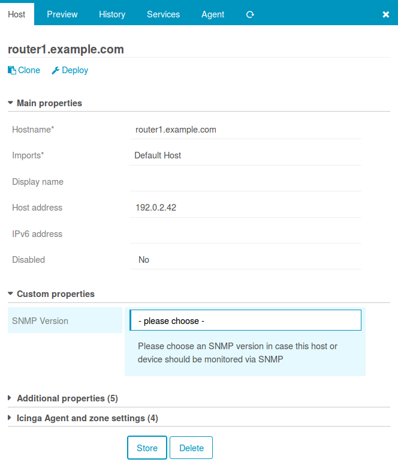
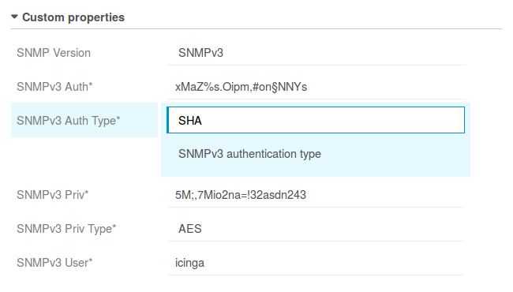

Data Fields example: SNMP
=========================

Ever wondered how to provide an easy to use SNMP configuration to your users?
That's what we're going to show in this example. Once completed, all your Hosts
inheriting a specific (or your "default") Host Template will provide an optional
`SNMP version` field.

In case you choose no version, nothing special will happen. Otherwise, the host
offers additional fields depending on the chosen version. `Community String` for
`SNMPv1` and `SNMPv2c`, and five other fields ranging from `Authentication User`
to `Auth` and `Priv` types and keys for `SNMPv3`.

Your services should now be applied not only based on various Host properties
like `Device Type`, `Application`, `Customer` or similar - but also based on
the fact whether credentials have been given or not.

Prepare required Data Fields
----------------------------

As we already have learned, `Fields` are what allows us to define which custom
variables can or should be defined following which rules. We want SNMP version
to be a drop-down, and that's why we first define a `Data List`, followed by
a `Data Field` using that list:

### Create a new Data List

### Fill the new list with SNMP versions

### Create a corresponding Data Field

Next, please also create the following elements:

* a list *SNMPv3 Auth Types* providing `MD5` and `SHA`
* a list *SNMPv3 Priv Types* providing at least `AES` and `DES`
* a `String` type field `snmp_community` labelled *SNMP Community*
* a `String` type field `snmpv3_user` labelled *SNMPv3 User*
* a `String` type field `snmpv3_auth` labelled *SNMPv3 Auth* (authentication key)
* a `String` type field `snmpv3_priv` labelled *SNMPv3 Priv* (encryption key)
* a `Data List` type field `snmpv3_authprot` labelled *SNMPv3 Auth Type*
* a `Data List` type field `snmpv3_privprot` labelled *SNMPv3 Priv Type*

Please do not forget to add meaningful descriptions, telling your users about
in-house best practices.

Assign your shiny new Fields to a Template
------------------------------------------

I'm using my default Host Template for this, but one might also choose to provide
`SNMP version` on Network Devices. Should Network Device be a template? Or just
an option in a `Device Type` field? You see, the possibilities are endless here.

This screenshot shows part of my assigned Fields:

While I kept `SNMP Version` optional, all other fields are mandatory.

Use your Template
-----------------

As soon as you choose your template, a new field is shown:

In case you change it to `SNMPv2c`, a `Community String` will be required:

Switch it to SNMPv3 to see completely different fields:

Once stored please check the rendered configuration. Switch the SNMP versions
forth and back, and you should see that filtered fields will also remove the
corresponding values from the object.

Assign Services based on those properties
-----------------------------------------

You should design your Commands to use that set of properties. Change the example
slightly to fit ITL Commands in case you're using those (snmpv3_*_type VS _alg).

Your Cisco Health checks assigned to all:

* routers or switches
* manifactured by Cisco
* with SNMP credentials, regardless of which version

...might then look as follows:

Have fun!
